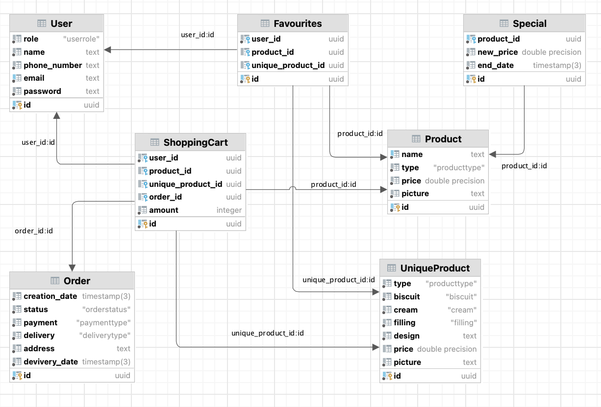

# Cup&Cake

**Тема проекта:** Магазин сладостей

*Описание:* На сайте вы сможете заказать все для сладкого вечера: торты, кексы, пончики, а также чай и кофе. А с помощью конструктора можно создать уникальный десерт в подарок.

[Посмотреть](https://cup-and-cake.onrender.com)

---
### Структура базы данных

**User** : пользователь сайта, у которого может быть две роли: покупатель, менеджер

**Product** : товар(десерт), который есть в катологе

**UniqueProduct** : кастомный десерт, который может составить покупатель

**Special** : специальные предложения, то есть товары, на которые какое-то время есть скидка

**Favourites** : избранное

**ShoppingCart** : корзина, связь покупателя с товаром, к которой ппотом привязывается заказ

**Order** : заказ

---
*Автор:* Комова Анна М33031
